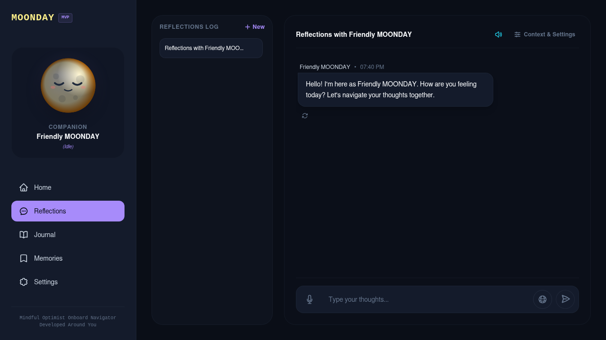

# MOONDAY

**Mindful Optimist Onboard Navigator Developed Around You**

MOONDAY is a private AI daily companion that helps you reflect, organize thoughts, notice emotional patterns, and navigate everyday life with a little more clarity. It is designed to feel like a small moonlit copilot: warm, context-aware, practical, and occasionally witty—not a generic chatbot or a clinical mental-health tool.

It can remember meaningful, user-approved context; support mood check-ins and daily reflections; adapt its communication style; and respond in the user’s language. Over time, MOONDAY is intended to become a thoughtful co-viewer too: a private space to bring a post, Reel, screenshot, or online moment for a reaction, a reality check, or a gentle joke.

## Preview



_A cinematic, full-dark reflection space with conversation history, companion context, mood-aware responses, and a focused composer._

## Guiding principles

- **Personal continuity:** conversations, memories, and reflections should help MOONDAY understand the user’s ongoing day and goals.
- **Privacy first:** personal context is handled deliberately; users should be able to review, edit, delete, or disable memories.
- **Emotionally aware, not clinical:** MOONDAY reflects possibilities and offers practical support. It does not diagnose or replace professional care.
- **User-controlled personality:** warmth, humor, directness, brevity, and language should match the user’s preference.
- **A thoughtful co-viewer, not surveillance:** users deliberately bring online content into chat; MOONDAY does not scrape feeds or monitor accounts.

## Current capabilities

- Persistent conversations and server-side chat
- Character profiles and adjustable response preferences
- English/Indonesian response detection and selection
- Mood check-ins, daily reflection, and memory extraction/recall
- Response controls such as regenerate, shorter, more practical, and go deeper
- Browser-native voice input and text-to-speech
- Multiple AI providers behind a shared abstraction

## Technology

- SvelteKit + Svelte + Tailwind CSS
- Bun
- PostgreSQL + Drizzle ORM, with pgvector-ready memory storage
- Web Speech API for initial voice support

## Local development

1. Start local PostgreSQL with `bun run db:up`.
2. Create a local environment file from the project example and add your AI provider credentials.
3. Install dependencies and start the app:

```sh
bun install
bun run db:migrate
bun run dev
```

For Docker, pgvector, database reset, and `psql` instructions, see [Local PostgreSQL with Docker](docs/local-postgres.md).

Useful checks:

```sh
bun run check
bun run test
bun run lint
```

## Product direction

MOONDAY is not intended to become a public character marketplace. Its focus is one person’s private, reliable companion experience: a small moon on the screen that listens, remembers what matters, and helps make the day easier to understand.

For planned work, see the [product backlog](docs/product-backlog.md) and the [Thoughtful Co-Viewer concept](docs/thoughtful-co-viewer.md).
